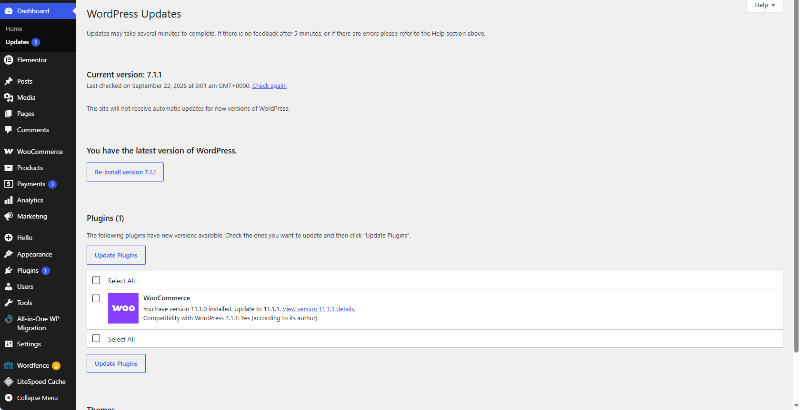
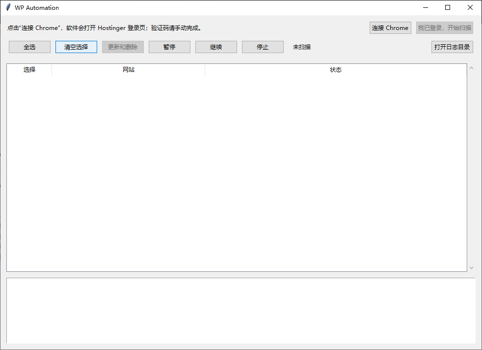
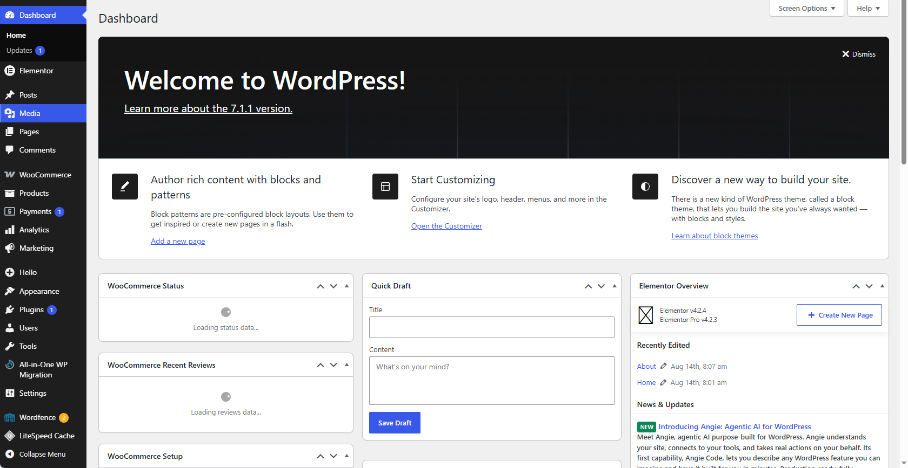
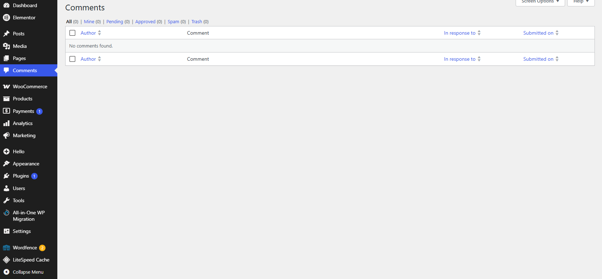
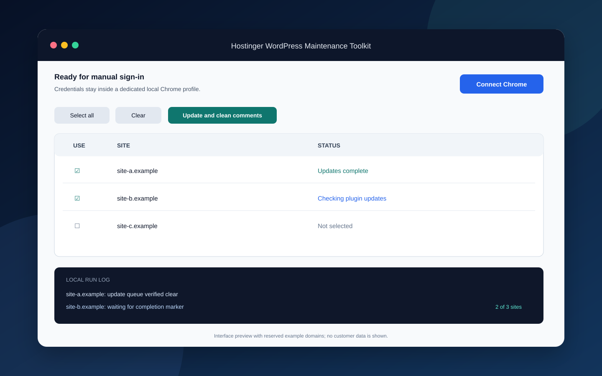

# Hostinger WordPress Maintenance Toolkit

A Windows desktop utility for maintainers who manage multiple independent WordPress installations through Hostinger hPanel. It discovers WordPress sites, performs core/theme/plugin/translation updates, verifies that update queues converge, and optionally clears comments in a controlled site-by-site workflow.

> **Important:** the comment-cleanup action deletes all visible comments and then permanently empties the comment trash. It is not a spam classifier. Use backups and test with a non-production site first.



The automation opens the standard WordPress Updates page, selects pending items, submits the update action, waits for completion feedback, and re-checks the queue before continuing.

## Why this project exists

Maintaining many small WordPress sites often means repeating the same navigation, update checks, completion checks, and cleanup steps. This project keeps the browser visible, requires the maintainer to complete authentication manually, processes one site at a time, and records per-site results for follow-up.

## Features

- Scan multiple pages of the Hostinger website list and deduplicate domains.
- Bind each discovered domain to its own WordPress admin action.
- Update WordPress core, themes, plugins, and translations in a deterministic order.
- Re-check the dashboard and update page before declaring a site current.
- Require repeated clear-state checks so delayed updates are not missed.
- Pause, resume, or stop a batch between sites.
- Keep Markdown run logs locally; no credentials are written to the repository.
- Run as source or as a double-clickable Windows EXE.

## Workflow screenshots

| Desktop application | Dashboard detection |
| --- | --- |
|  |  |

| Updates workflow | Comment cleanup result |
| --- | --- |
|  |  |

The screenshots use no visible customer domain or account identifier. The empty comments page confirms the observed final state only; it does not replace backups or an independent audit trail.

### Desktop interface preview



## Install from a Release

1. Download `HostingerWordPressMaintenanceToolkit-v1.0.0.exe` from GitHub Releases.
2. Place it in its own writable folder.
3. Double-click the EXE and choose **Connect Chrome**.
4. Complete Hostinger login, SSO, or security verification yourself in the opened Chrome window.
5. Return to the app, scan sites, select the intended targets, and start maintenance.

The application creates its browser profile and logs beside the executable. Those local files can contain sensitive session data and must never be uploaded or shared.

## Run from source

Requirements: Windows 10/11, Python 3.11 or 3.12, Google Chrome.

```powershell
python -m venv .venv
.\.venv\Scripts\python.exe -m pip install -r requirements.txt
.\.venv\Scripts\python.exe app.py
```

Run the regression tests:

```powershell
.\.venv\Scripts\python.exe -m unittest discover -s tests -v
```

Build a local EXE:

```powershell
powershell -ExecutionPolicy Bypass -File packaging\build.ps1
```

### Source provenance

The public tree combines maintained source files with source equivalents restored from the project's own preserved CPython bytecode after source loss. Restored modules were reviewed and regression-tested, but this release does not claim byte-for-byte identity with the lost originals.

## Security and privacy

- Passwords, cookies, sessions, SSO URLs, tokens, site inventories, and Chrome profiles are intentionally excluded.
- Authentication remains in a dedicated local Chrome profile and is completed manually.
- The repository contains only public vendor URLs and reserved example domains used by tests.
- Run `python scripts/check_release.py .` before every public push.
- Review [SECURITY.md](SECURITY.md) before reporting a vulnerability.

## Operational safety

- Back up each WordPress site before applying updates or deleting comments.
- The tool does not provide automatic backup, rollback, or compatibility testing.
- A timeout or unknown page state is recorded as a failure, not success.
- Review every selected domain before starting a destructive batch.

## Current release

Version `v1.0.0` consolidates the maintained desktop workflow into the first public release. It includes the real fixes tracked in Issues #1 through #5; see [RELEASE_NOTES.md](RELEASE_NOTES.md).

## License

[MIT](LICENSE)
